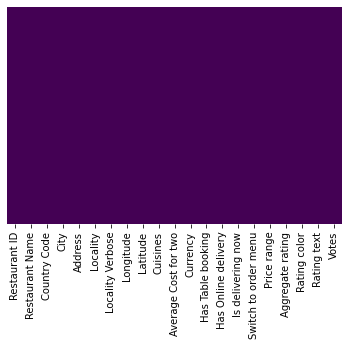
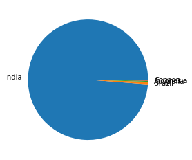
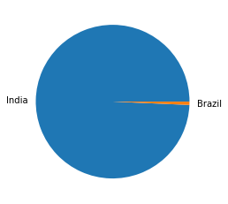
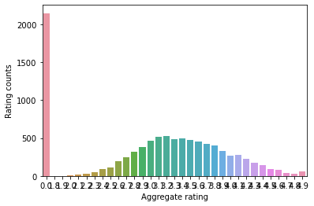
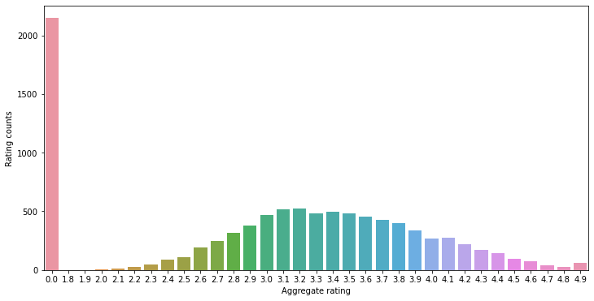
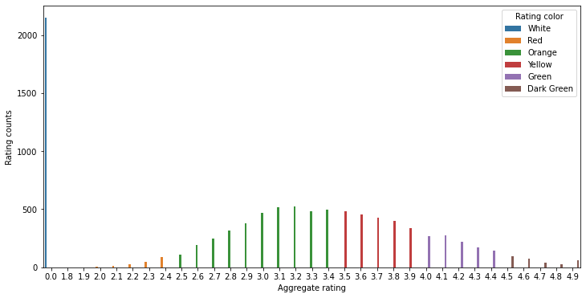
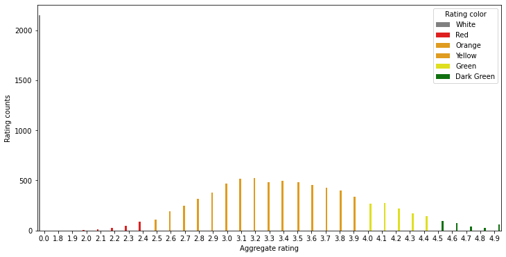
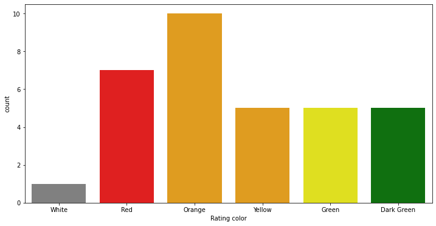
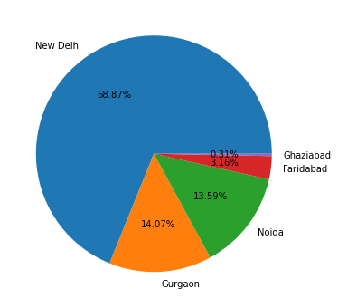

# Zomato EDA


```python
#IMPORT LIBRARIES
import pandas as pd
import numpy as np
import matplotlib as plt
import seaborn as sns
import matplotlib.pyplot as plt
%matplotlib inline
```


```python
df = pd.read_csv('zomato.csv' , encoding = 'latin-1')
df.head()
 
```


<div>
<style scoped>
    .dataframe tbody tr th:only-of-type {
        vertical-align: middle;
    }

    .dataframe tbody tr th {
        vertical-align: top;
    }

    .dataframe thead th {
        text-align: right;
    }
</style>
<table border="1" class="dataframe">
  <thead>
    <tr style="text-align: right;">
      <th></th>
      <th>Restaurant ID</th>
      <th>Restaurant Name</th>
      <th>Country Code</th>
      <th>City</th>
      <th>Address</th>
      <th>Locality</th>
      <th>Locality Verbose</th>
      <th>Longitude</th>
      <th>Latitude</th>
      <th>Cuisines</th>
      <th>...</th>
      <th>Currency</th>
      <th>Has Table booking</th>
      <th>Has Online delivery</th>
      <th>Is delivering now</th>
      <th>Switch to order menu</th>
      <th>Price range</th>
      <th>Aggregate rating</th>
      <th>Rating color</th>
      <th>Rating text</th>
      <th>Votes</th>
    </tr>
  </thead>
  <tbody>
    <tr>
      <th>0</th>
      <td>6317637</td>
      <td>Le Petit Souffle</td>
      <td>162</td>
      <td>Makati City</td>
      <td>Third Floor, Century City Mall, Kalayaan Avenu...</td>
      <td>Century City Mall, Poblacion, Makati City</td>
      <td>Century City Mall, Poblacion, Makati City, Mak...</td>
      <td>121.027535</td>
      <td>14.565443</td>
      <td>French, Japanese, Desserts</td>
      <td>...</td>
      <td>Botswana Pula(P)</td>
      <td>Yes</td>
      <td>No</td>
      <td>No</td>
      <td>No</td>
      <td>3</td>
      <td>4.8</td>
      <td>Dark Green</td>
      <td>Excellent</td>
      <td>314</td>
    </tr>
    <tr>
      <th>1</th>
      <td>6304287</td>
      <td>Izakaya Kikufuji</td>
      <td>162</td>
      <td>Makati City</td>
      <td>Little Tokyo, 2277 Chino Roces Avenue, Legaspi...</td>
      <td>Little Tokyo, Legaspi Village, Makati City</td>
      <td>Little Tokyo, Legaspi Village, Makati City, Ma...</td>
      <td>121.014101</td>
      <td>14.553708</td>
      <td>Japanese</td>
      <td>...</td>
      <td>Botswana Pula(P)</td>
      <td>Yes</td>
      <td>No</td>
      <td>No</td>
      <td>No</td>
      <td>3</td>
      <td>4.5</td>
      <td>Dark Green</td>
      <td>Excellent</td>
      <td>591</td>
    </tr>
    <tr>
      <th>2</th>
      <td>6300002</td>
      <td>Heat - Edsa Shangri-La</td>
      <td>162</td>
      <td>Mandaluyong City</td>
      <td>Edsa Shangri-La, 1 Garden Way, Ortigas, Mandal...</td>
      <td>Edsa Shangri-La, Ortigas, Mandaluyong City</td>
      <td>Edsa Shangri-La, Ortigas, Mandaluyong City, Ma...</td>
      <td>121.056831</td>
      <td>14.581404</td>
      <td>Seafood, Asian, Filipino, Indian</td>
      <td>...</td>
      <td>Botswana Pula(P)</td>
      <td>Yes</td>
      <td>No</td>
      <td>No</td>
      <td>No</td>
      <td>4</td>
      <td>4.4</td>
      <td>Green</td>
      <td>Very Good</td>
      <td>270</td>
    </tr>
    <tr>
      <th>3</th>
      <td>6318506</td>
      <td>Ooma</td>
      <td>162</td>
      <td>Mandaluyong City</td>
      <td>Third Floor, Mega Fashion Hall, SM Megamall, O...</td>
      <td>SM Megamall, Ortigas, Mandaluyong City</td>
      <td>SM Megamall, Ortigas, Mandaluyong City, Mandal...</td>
      <td>121.056475</td>
      <td>14.585318</td>
      <td>Japanese, Sushi</td>
      <td>...</td>
      <td>Botswana Pula(P)</td>
      <td>No</td>
      <td>No</td>
      <td>No</td>
      <td>No</td>
      <td>4</td>
      <td>4.9</td>
      <td>Dark Green</td>
      <td>Excellent</td>
      <td>365</td>
    </tr>
    <tr>
      <th>4</th>
      <td>6314302</td>
      <td>Sambo Kojin</td>
      <td>162</td>
      <td>Mandaluyong City</td>
      <td>Third Floor, Mega Atrium, SM Megamall, Ortigas...</td>
      <td>SM Megamall, Ortigas, Mandaluyong City</td>
      <td>SM Megamall, Ortigas, Mandaluyong City, Mandal...</td>
      <td>121.057508</td>
      <td>14.584450</td>
      <td>Japanese, Korean</td>
      <td>...</td>
      <td>Botswana Pula(P)</td>
      <td>Yes</td>
      <td>No</td>
      <td>No</td>
      <td>No</td>
      <td>4</td>
      <td>4.8</td>
      <td>Dark Green</td>
      <td>Excellent</td>
      <td>229</td>
    </tr>
  </tbody>
</table>
<p>5 rows × 21 columns</p>
</div>


```python
#basics colums do i have
df.columns
```


    Index(['Restaurant ID', 'Restaurant Name', 'Country Code', 'City', 'Address',
           'Locality', 'Locality Verbose', 'Longitude', 'Latitude', 'Cuisines',
           'Average Cost for two', 'Currency', 'Has Table booking',
           'Has Online delivery', 'Is delivering now', 'Switch to order menu',
           'Price range', 'Aggregate rating', 'Rating color', 'Rating text',
           'Votes'],
          dtype='object')


```python
df.info()
```

    <class 'pandas.core.frame.DataFrame'>
    RangeIndex: 9551 entries, 0 to 9550
    Data columns (total 21 columns):
     #   Column                Non-Null Count  Dtype  
    ---  ------                --------------  -----  
     0   Restaurant ID         9551 non-null   int64  
     1   Restaurant Name       9551 non-null   object 
     2   Country Code          9551 non-null   int64  
     3   City                  9551 non-null   object 
     4   Address               9551 non-null   object 
     5   Locality              9551 non-null   object 
     6   Locality Verbose      9551 non-null   object 
     7   Longitude             9551 non-null   float64
     8   Latitude              9551 non-null   float64
     9   Cuisines              9542 non-null   object 
     10  Average Cost for two  9551 non-null   int64  
     11  Currency              9551 non-null   object 
     12  Has Table booking     9551 non-null   object 
     13  Has Online delivery   9551 non-null   object 
     14  Is delivering now     9551 non-null   object 
     15  Switch to order menu  9551 non-null   object 
     16  Price range           9551 non-null   int64  
     17  Aggregate rating      9551 non-null   float64
     18  Rating color          9551 non-null   object 
     19  Rating text           9551 non-null   object 
     20  Votes                 9551 non-null   int64  
    dtypes: float64(3), int64(5), object(13)
    memory usage: 1.5+ MB
    


```python
df.describe() #only interger feature gives some basic informatin like mean median mode
```


<div>
<style scoped>
    .dataframe tbody tr th:only-of-type {
        vertical-align: middle;
    }

    .dataframe tbody tr th {
        vertical-align: top;
    }

    .dataframe thead th {
        text-align: right;
    }
</style>
<table border="1" class="dataframe">
  <thead>
    <tr style="text-align: right;">
      <th></th>
      <th>Restaurant ID</th>
      <th>Country Code</th>
      <th>Longitude</th>
      <th>Latitude</th>
      <th>Average Cost for two</th>
      <th>Price range</th>
      <th>Aggregate rating</th>
      <th>Votes</th>
    </tr>
  </thead>
  <tbody>
    <tr>
      <th>count</th>
      <td>9.551000e+03</td>
      <td>9551.000000</td>
      <td>9551.000000</td>
      <td>9551.000000</td>
      <td>9551.000000</td>
      <td>9551.000000</td>
      <td>9551.000000</td>
      <td>9551.000000</td>
    </tr>
    <tr>
      <th>mean</th>
      <td>9.051128e+06</td>
      <td>18.365616</td>
      <td>64.126574</td>
      <td>25.854381</td>
      <td>1199.210763</td>
      <td>1.804837</td>
      <td>2.666370</td>
      <td>156.909748</td>
    </tr>
    <tr>
      <th>std</th>
      <td>8.791521e+06</td>
      <td>56.750546</td>
      <td>41.467058</td>
      <td>11.007935</td>
      <td>16121.183073</td>
      <td>0.905609</td>
      <td>1.516378</td>
      <td>430.169145</td>
    </tr>
    <tr>
      <th>min</th>
      <td>5.300000e+01</td>
      <td>1.000000</td>
      <td>-157.948486</td>
      <td>-41.330428</td>
      <td>0.000000</td>
      <td>1.000000</td>
      <td>0.000000</td>
      <td>0.000000</td>
    </tr>
    <tr>
      <th>25%</th>
      <td>3.019625e+05</td>
      <td>1.000000</td>
      <td>77.081343</td>
      <td>28.478713</td>
      <td>250.000000</td>
      <td>1.000000</td>
      <td>2.500000</td>
      <td>5.000000</td>
    </tr>
    <tr>
      <th>50%</th>
      <td>6.004089e+06</td>
      <td>1.000000</td>
      <td>77.191964</td>
      <td>28.570469</td>
      <td>400.000000</td>
      <td>2.000000</td>
      <td>3.200000</td>
      <td>31.000000</td>
    </tr>
    <tr>
      <th>75%</th>
      <td>1.835229e+07</td>
      <td>1.000000</td>
      <td>77.282006</td>
      <td>28.642758</td>
      <td>700.000000</td>
      <td>2.000000</td>
      <td>3.700000</td>
      <td>131.000000</td>
    </tr>
    <tr>
      <th>max</th>
      <td>1.850065e+07</td>
      <td>216.000000</td>
      <td>174.832089</td>
      <td>55.976980</td>
      <td>800000.000000</td>
      <td>4.000000</td>
      <td>4.900000</td>
      <td>10934.000000</td>
    </tr>
  </tbody>
</table>
</div>


# In data analysis  what all things we do
1 missing values

2 explore about the numerical values

3 explore about categorical variables

4 finding relationship between features


```python
df.isnull().sum()
```


    Restaurant ID           0
    Restaurant Name         0
    Country Code            0
    City                    0
    Address                 0
    Locality                0
    Locality Verbose        0
    Longitude               0
    Latitude                0
    Cuisines                9
    Average Cost for two    0
    Currency                0
    Has Table booking       0
    Has Online delivery     0
    Is delivering now       0
    Switch to order menu    0
    Price range             0
    Aggregate rating        0
    Rating color            0
    Rating text             0
    Votes                   0
    dtype: int64


```python
[features for features in df.columns if df[features].isnull().sum()>0]
```


    ['Cuisines']


```python
#heatmap
sns.heatmap(df.isnull() , yticklabels = False , cbar = False,cmap='viridis')
```


    <AxesSubplot:>


    

    


```python
#so we could able to see becuase very small amount is empty
df.shape
```


    (9551, 21)


```python
df_country=pd.read_csv('Country-Code.csv')
df_country.head()
```


<div>
<style scoped>
    .dataframe tbody tr th:only-of-type {
        vertical-align: middle;
    }

    .dataframe tbody tr th {
        vertical-align: top;
    }

    .dataframe thead th {
        text-align: right;
    }
</style>
<table border="1" class="dataframe">
  <thead>
    <tr style="text-align: right;">
      <th></th>
      <th>Country Code</th>
      <th>Country</th>
    </tr>
  </thead>
  <tbody>
    <tr>
      <th>0</th>
      <td>1</td>
      <td>India</td>
    </tr>
    <tr>
      <th>1</th>
      <td>14</td>
      <td>Australia</td>
    </tr>
    <tr>
      <th>2</th>
      <td>30</td>
      <td>Brazil</td>
    </tr>
    <tr>
      <th>3</th>
      <td>37</td>
      <td>Canada</td>
    </tr>
    <tr>
      <th>4</th>
      <td>94</td>
      <td>Indonesia</td>
    </tr>
  </tbody>
</table>
</div>


```python
df.columns
```


    Index(['Restaurant ID', 'Restaurant Name', 'Country Code', 'City', 'Address',
           'Locality', 'Locality Verbose', 'Longitude', 'Latitude', 'Cuisines',
           'Average Cost for two', 'Currency', 'Has Table booking',
           'Has Online delivery', 'Is delivering now', 'Switch to order menu',
           'Price range', 'Aggregate rating', 'Rating color', 'Rating text',
           'Votes'],
          dtype='object')


```python
final_df = pd.merge(df,df_country,on='Country Code' , how = 'left')
```


```python
final_df.head(2)
```


<div>
<style scoped>
    .dataframe tbody tr th:only-of-type {
        vertical-align: middle;
    }

    .dataframe tbody tr th {
        vertical-align: top;
    }

    .dataframe thead th {
        text-align: right;
    }
</style>
<table border="1" class="dataframe">
  <thead>
    <tr style="text-align: right;">
      <th></th>
      <th>Restaurant ID</th>
      <th>Restaurant Name</th>
      <th>Country Code</th>
      <th>City</th>
      <th>Address</th>
      <th>Locality</th>
      <th>Locality Verbose</th>
      <th>Longitude</th>
      <th>Latitude</th>
      <th>Cuisines</th>
      <th>...</th>
      <th>Has Table booking</th>
      <th>Has Online delivery</th>
      <th>Is delivering now</th>
      <th>Switch to order menu</th>
      <th>Price range</th>
      <th>Aggregate rating</th>
      <th>Rating color</th>
      <th>Rating text</th>
      <th>Votes</th>
      <th>Country</th>
    </tr>
  </thead>
  <tbody>
    <tr>
      <th>0</th>
      <td>6317637</td>
      <td>Le Petit Souffle</td>
      <td>162</td>
      <td>Makati City</td>
      <td>Third Floor, Century City Mall, Kalayaan Avenu...</td>
      <td>Century City Mall, Poblacion, Makati City</td>
      <td>Century City Mall, Poblacion, Makati City, Mak...</td>
      <td>121.027535</td>
      <td>14.565443</td>
      <td>French, Japanese, Desserts</td>
      <td>...</td>
      <td>Yes</td>
      <td>No</td>
      <td>No</td>
      <td>No</td>
      <td>3</td>
      <td>4.8</td>
      <td>Dark Green</td>
      <td>Excellent</td>
      <td>314</td>
      <td>NaN</td>
    </tr>
    <tr>
      <th>1</th>
      <td>6304287</td>
      <td>Izakaya Kikufuji</td>
      <td>162</td>
      <td>Makati City</td>
      <td>Little Tokyo, 2277 Chino Roces Avenue, Legaspi...</td>
      <td>Little Tokyo, Legaspi Village, Makati City</td>
      <td>Little Tokyo, Legaspi Village, Makati City, Ma...</td>
      <td>121.014101</td>
      <td>14.553708</td>
      <td>Japanese</td>
      <td>...</td>
      <td>Yes</td>
      <td>No</td>
      <td>No</td>
      <td>No</td>
      <td>3</td>
      <td>4.5</td>
      <td>Dark Green</td>
      <td>Excellent</td>
      <td>591</td>
      <td>NaN</td>
    </tr>
  </tbody>
</table>
<p>2 rows × 22 columns</p>
</div>


```python
# check data type
final_df.dtypes
```


    Restaurant ID             int64
    Restaurant Name          object
    Country Code              int64
    City                     object
    Address                  object
    Locality                 object
    Locality Verbose         object
    Longitude               float64
    Latitude                float64
    Cuisines                 object
    Average Cost for two      int64
    Currency                 object
    Has Table booking        object
    Has Online delivery      object
    Is delivering now        object
    Switch to order menu     object
    Price range               int64
    Aggregate rating        float64
    Rating color             object
    Rating text              object
    Votes                     int64
    Country                  object
    dtype: object


```python
#how many country are there and with respect t country how much data we have
final_df.Country.value_counts()

```


    India        8652
    Brazil         60
    Australia      24
    Indonesia      21
    Canada          4
    Name: Country, dtype: int64


so i can see max number pf transaction are there in india


```python
country_names = final_df.Country.value_counts().index
country_names
```


    Index(['India', 'Brazil', 'Australia', 'Indonesia', 'Canada'], dtype='object')


```python
country_val=final_df.Country.value_counts().values
```


```python
## pie charts
plt.pie(country_val,labels = country_names)
```


    ([<matplotlib.patches.Wedge at 0x19896211610>,
      <matplotlib.patches.Wedge at 0x19896211b50>,
      <matplotlib.patches.Wedge at 0x19896211fd0>,
      <matplotlib.patches.Wedge at 0x1989621d550>,
      <matplotlib.patches.Wedge at 0x1989621d9d0>],
     [Text(-1.0991598559747335, 0.04298384596105192, 'India'),
      Text(1.0982349605947188, -0.06228941585467697, 'Brazil'),
      Text(1.0996127460282028, -0.029185763178566422, 'Australia'),
      Text(1.0999405222652252, -0.01143885828673111, 'Indonesia'),
      Text(1.0999988683092192, -0.0015778841646890832, 'Canada')])


    

    


```python
# pie chart top trhree componies which uses zomato
plt.pie(country_val[:2],labels = country_names[:2])
```


    ([<matplotlib.patches.Wedge at 0x19895d16610>,
      <matplotlib.patches.Wedge at 0x19895d16b50>],
     [Text(-1.0997425365812628, 0.02379817711107794, 'India'),
      Text(1.0997425346316312, -0.02379826720573946, 'Brazil')])


    

    


```python
#lets see percwntage   for percentage == autopct = '%1.2f%%'
plt.pie(country_val[:2],labels = country_names[:2],autopct = '%1.2f%%')
```


    ([<matplotlib.patches.Wedge at 0x19895fbf6a0>,
      <matplotlib.patches.Wedge at 0x19895fbfe20>],
     [Text(-1.0997425365812628, 0.02379817711107794, 'India'),
      Text(1.0997425346316312, -0.02379826720573946, 'Brazil')],
     [Text(-0.5998595654079615, 0.012980823878769783, '99.31%'),
      Text(0.599859564344526, -0.012980873021312431, '0.69%')])


    

    


obsercation:- zomato contribute 99.31 share in india so max transaction are from india 


```python
final_df.columns
```


    Index(['Restaurant ID', 'Restaurant Name', 'Country Code', 'City', 'Address',
           'Locality', 'Locality Verbose', 'Longitude', 'Latitude', 'Cuisines',
           'Average Cost for two', 'Currency', 'Has Table booking',
           'Has Online delivery', 'Is delivering now', 'Switch to order menu',
           'Price range', 'Aggregate rating', 'Rating color', 'Rating text',
           'Votes', 'Country'],
          dtype='object')


```python
#lets aggregate ratings
final_df.groupby(['Aggregate rating','Rating color','Rating text'])
```


    <pandas.core.groupby.generic.DataFrameGroupBy object at 0x00000198961DB550>


```python
final_df.groupby(['Aggregate rating','Rating color','Rating text']).size()
```


    Aggregate rating  Rating color  Rating text
    0.0               White         Not rated      2148
    1.8               Red           Poor              1
    1.9               Red           Poor              2
    2.0               Red           Poor              7
    2.1               Red           Poor             15
    2.2               Red           Poor             27
    2.3               Red           Poor             47
    2.4               Red           Poor             87
    2.5               Orange        Average         110
    2.6               Orange        Average         191
    2.7               Orange        Average         250
    2.8               Orange        Average         315
    2.9               Orange        Average         381
    3.0               Orange        Average         468
    3.1               Orange        Average         519
    3.2               Orange        Average         522
    3.3               Orange        Average         483
    3.4               Orange        Average         498
    3.5               Yellow        Good            480
    3.6               Yellow        Good            458
    3.7               Yellow        Good            427
    3.8               Yellow        Good            400
    3.9               Yellow        Good            335
    4.0               Green         Very Good       266
    4.1               Green         Very Good       274
    4.2               Green         Very Good       221
    4.3               Green         Very Good       174
    4.4               Green         Very Good       144
    4.5               Dark Green    Excellent        95
    4.6               Dark Green    Excellent        78
    4.7               Dark Green    Excellent        42
    4.8               Dark Green    Excellent        25
    4.9               Dark Green    Excellent        61
    dtype: int64


```python
ratings =final_df.groupby(['Aggregate rating','Rating color','Rating text']).size().reset_index().rename(columns={0:'Rating counts'})
```


```python
ratings
```


<div>
<style scoped>
    .dataframe tbody tr th:only-of-type {
        vertical-align: middle;
    }

    .dataframe tbody tr th {
        vertical-align: top;
    }

    .dataframe thead th {
        text-align: right;
    }
</style>
<table border="1" class="dataframe">
  <thead>
    <tr style="text-align: right;">
      <th></th>
      <th>Aggregate rating</th>
      <th>Rating color</th>
      <th>Rating text</th>
      <th>Rating counts</th>
    </tr>
  </thead>
  <tbody>
    <tr>
      <th>0</th>
      <td>0.0</td>
      <td>White</td>
      <td>Not rated</td>
      <td>2148</td>
    </tr>
    <tr>
      <th>1</th>
      <td>1.8</td>
      <td>Red</td>
      <td>Poor</td>
      <td>1</td>
    </tr>
    <tr>
      <th>2</th>
      <td>1.9</td>
      <td>Red</td>
      <td>Poor</td>
      <td>2</td>
    </tr>
    <tr>
      <th>3</th>
      <td>2.0</td>
      <td>Red</td>
      <td>Poor</td>
      <td>7</td>
    </tr>
    <tr>
      <th>4</th>
      <td>2.1</td>
      <td>Red</td>
      <td>Poor</td>
      <td>15</td>
    </tr>
    <tr>
      <th>5</th>
      <td>2.2</td>
      <td>Red</td>
      <td>Poor</td>
      <td>27</td>
    </tr>
    <tr>
      <th>6</th>
      <td>2.3</td>
      <td>Red</td>
      <td>Poor</td>
      <td>47</td>
    </tr>
    <tr>
      <th>7</th>
      <td>2.4</td>
      <td>Red</td>
      <td>Poor</td>
      <td>87</td>
    </tr>
    <tr>
      <th>8</th>
      <td>2.5</td>
      <td>Orange</td>
      <td>Average</td>
      <td>110</td>
    </tr>
    <tr>
      <th>9</th>
      <td>2.6</td>
      <td>Orange</td>
      <td>Average</td>
      <td>191</td>
    </tr>
    <tr>
      <th>10</th>
      <td>2.7</td>
      <td>Orange</td>
      <td>Average</td>
      <td>250</td>
    </tr>
    <tr>
      <th>11</th>
      <td>2.8</td>
      <td>Orange</td>
      <td>Average</td>
      <td>315</td>
    </tr>
    <tr>
      <th>12</th>
      <td>2.9</td>
      <td>Orange</td>
      <td>Average</td>
      <td>381</td>
    </tr>
    <tr>
      <th>13</th>
      <td>3.0</td>
      <td>Orange</td>
      <td>Average</td>
      <td>468</td>
    </tr>
    <tr>
      <th>14</th>
      <td>3.1</td>
      <td>Orange</td>
      <td>Average</td>
      <td>519</td>
    </tr>
    <tr>
      <th>15</th>
      <td>3.2</td>
      <td>Orange</td>
      <td>Average</td>
      <td>522</td>
    </tr>
    <tr>
      <th>16</th>
      <td>3.3</td>
      <td>Orange</td>
      <td>Average</td>
      <td>483</td>
    </tr>
    <tr>
      <th>17</th>
      <td>3.4</td>
      <td>Orange</td>
      <td>Average</td>
      <td>498</td>
    </tr>
    <tr>
      <th>18</th>
      <td>3.5</td>
      <td>Yellow</td>
      <td>Good</td>
      <td>480</td>
    </tr>
    <tr>
      <th>19</th>
      <td>3.6</td>
      <td>Yellow</td>
      <td>Good</td>
      <td>458</td>
    </tr>
    <tr>
      <th>20</th>
      <td>3.7</td>
      <td>Yellow</td>
      <td>Good</td>
      <td>427</td>
    </tr>
    <tr>
      <th>21</th>
      <td>3.8</td>
      <td>Yellow</td>
      <td>Good</td>
      <td>400</td>
    </tr>
    <tr>
      <th>22</th>
      <td>3.9</td>
      <td>Yellow</td>
      <td>Good</td>
      <td>335</td>
    </tr>
    <tr>
      <th>23</th>
      <td>4.0</td>
      <td>Green</td>
      <td>Very Good</td>
      <td>266</td>
    </tr>
    <tr>
      <th>24</th>
      <td>4.1</td>
      <td>Green</td>
      <td>Very Good</td>
      <td>274</td>
    </tr>
    <tr>
      <th>25</th>
      <td>4.2</td>
      <td>Green</td>
      <td>Very Good</td>
      <td>221</td>
    </tr>
    <tr>
      <th>26</th>
      <td>4.3</td>
      <td>Green</td>
      <td>Very Good</td>
      <td>174</td>
    </tr>
    <tr>
      <th>27</th>
      <td>4.4</td>
      <td>Green</td>
      <td>Very Good</td>
      <td>144</td>
    </tr>
    <tr>
      <th>28</th>
      <td>4.5</td>
      <td>Dark Green</td>
      <td>Excellent</td>
      <td>95</td>
    </tr>
    <tr>
      <th>29</th>
      <td>4.6</td>
      <td>Dark Green</td>
      <td>Excellent</td>
      <td>78</td>
    </tr>
    <tr>
      <th>30</th>
      <td>4.7</td>
      <td>Dark Green</td>
      <td>Excellent</td>
      <td>42</td>
    </tr>
    <tr>
      <th>31</th>
      <td>4.8</td>
      <td>Dark Green</td>
      <td>Excellent</td>
      <td>25</td>
    </tr>
    <tr>
      <th>32</th>
      <td>4.9</td>
      <td>Dark Green</td>
      <td>Excellent</td>
      <td>61</td>
    </tr>
  </tbody>
</table>
</div>


#observation
When Rating is between 4.5 to 4.9---> Excellent 

When Rating are between 4.0 to 3.4--->very good

when Rating is between 3.5 to 3.9----> good

when Rating is between 3.0 to 3.4----> average

when Rating is between 2.5 to 2.9----> average

when Rating is between 2.0 to 2.4----> Poor


```python
ratings.head()
```


<div>
<style scoped>
    .dataframe tbody tr th:only-of-type {
        vertical-align: middle;
    }

    .dataframe tbody tr th {
        vertical-align: top;
    }

    .dataframe thead th {
        text-align: right;
    }
</style>
<table border="1" class="dataframe">
  <thead>
    <tr style="text-align: right;">
      <th></th>
      <th>Aggregate rating</th>
      <th>Rating color</th>
      <th>Rating text</th>
      <th>Rating counts</th>
    </tr>
  </thead>
  <tbody>
    <tr>
      <th>0</th>
      <td>0.0</td>
      <td>White</td>
      <td>Not rated</td>
      <td>2148</td>
    </tr>
    <tr>
      <th>1</th>
      <td>1.8</td>
      <td>Red</td>
      <td>Poor</td>
      <td>1</td>
    </tr>
    <tr>
      <th>2</th>
      <td>1.9</td>
      <td>Red</td>
      <td>Poor</td>
      <td>2</td>
    </tr>
    <tr>
      <th>3</th>
      <td>2.0</td>
      <td>Red</td>
      <td>Poor</td>
      <td>7</td>
    </tr>
    <tr>
      <th>4</th>
      <td>2.1</td>
      <td>Red</td>
      <td>Poor</td>
      <td>15</td>
    </tr>
  </tbody>
</table>
</div>


```python
sns.barplot(x="Aggregate rating",y="Rating counts",data=ratings)
```


    <AxesSubplot:xlabel='Aggregate rating', ylabel='Rating counts'>


    

    


```python
#it is looking very small so lets increaSE  a size
import matplotlib
matplotlib.rcParams['figure.figsize'] = (12,6) # used to increase a size of a graph
sns.barplot(x="Aggregate rating",y="Rating counts",data=ratings)
```


    <AxesSubplot:xlabel='Aggregate rating', ylabel='Rating counts'>


    

    


```python
#get colours according to ratijng colour
sns.barplot(x='Aggregate rating' , y='Rating counts' , hue='Rating color',data = ratings ) 
```


    <AxesSubplot:xlabel='Aggregate rating', ylabel='Rating counts'>


    

    


```python
#lets map a colour
sns.barplot(x='Aggregate rating' , y='Rating counts' , hue='Rating color',data = ratings,palette = ['grey','red','orange','orange','yellow','green' ,'green']) 
```


    <AxesSubplot:xlabel='Aggregate rating', ylabel='Rating counts'>


    

    


1. not rated count is very high
2. max rating are between 2.5 to 3.4


```python
# count plot and they are not rfating count threy colour count
sns.countplot(x="Rating color" , data = ratings,palette=['grey','red','orange','orange','yellow','green' ,'green'])
```


    <AxesSubplot:xlabel='Rating color', ylabel='count'>


    

    


##find the country name that has given zero ratings


```python
final_df.columns
```


    Index(['Restaurant ID', 'Restaurant Name', 'Country Code', 'City', 'Address',
           'Locality', 'Locality Verbose', 'Longitude', 'Latitude', 'Cuisines',
           'Average Cost for two', 'Currency', 'Has Table booking',
           'Has Online delivery', 'Is delivering now', 'Switch to order menu',
           'Price range', 'Aggregate rating', 'Rating color', 'Rating text',
           'Votes', 'Country'],
          dtype='object')


```python
final_df[final_df['Rating color']=='White'].groupby('Country').size().reset_index()
```


<div>
<style scoped>
    .dataframe tbody tr th:only-of-type {
        vertical-align: middle;
    }

    .dataframe tbody tr th {
        vertical-align: top;
    }

    .dataframe thead th {
        text-align: right;
    }
</style>
<table border="1" class="dataframe">
  <thead>
    <tr style="text-align: right;">
      <th></th>
      <th>Country</th>
      <th>0</th>
    </tr>
  </thead>
  <tbody>
    <tr>
      <th>0</th>
      <td>Brazil</td>
      <td>5</td>
    </tr>
    <tr>
      <th>1</th>
      <td>India</td>
      <td>2139</td>
    </tr>
  </tbody>
</table>
</div>


```python
final_df.groupby(['Aggregate rating', 'Country']).size().reset_index().head(5)
```


<div>
<style scoped>
    .dataframe tbody tr th:only-of-type {
        vertical-align: middle;
    }

    .dataframe tbody tr th {
        vertical-align: top;
    }

    .dataframe thead th {
        text-align: right;
    }
</style>
<table border="1" class="dataframe">
  <thead>
    <tr style="text-align: right;">
      <th></th>
      <th>Aggregate rating</th>
      <th>Country</th>
      <th>0</th>
    </tr>
  </thead>
  <tbody>
    <tr>
      <th>0</th>
      <td>0.0</td>
      <td>Brazil</td>
      <td>5</td>
    </tr>
    <tr>
      <th>1</th>
      <td>0.0</td>
      <td>India</td>
      <td>2139</td>
    </tr>
    <tr>
      <th>2</th>
      <td>1.8</td>
      <td>India</td>
      <td>1</td>
    </tr>
    <tr>
      <th>3</th>
      <td>1.9</td>
      <td>India</td>
      <td>2</td>
    </tr>
    <tr>
      <th>4</th>
      <td>2.0</td>
      <td>India</td>
      <td>7</td>
    </tr>
  </tbody>
</table>
</div>


```python
#find out whic curency is used in specific pin coides
```


```python
final_df.columns
```


    Index(['Restaurant ID', 'Restaurant Name', 'Country Code', 'City', 'Address',
           'Locality', 'Locality Verbose', 'Longitude', 'Latitude', 'Cuisines',
           'Average Cost for two', 'Currency', 'Has Table booking',
           'Has Online delivery', 'Is delivering now', 'Switch to order menu',
           'Price range', 'Aggregate rating', 'Rating color', 'Rating text',
           'Votes', 'Country'],
          dtype='object')


```python
final_df.groupby(['Country Code', 'Currency']).size().reset_index()
```


<div>
<style scoped>
    .dataframe tbody tr th:only-of-type {
        vertical-align: middle;
    }

    .dataframe tbody tr th {
        vertical-align: top;
    }

    .dataframe thead th {
        text-align: right;
    }
</style>
<table border="1" class="dataframe">
  <thead>
    <tr style="text-align: right;">
      <th></th>
      <th>Country Code</th>
      <th>Currency</th>
      <th>0</th>
    </tr>
  </thead>
  <tbody>
    <tr>
      <th>0</th>
      <td>1</td>
      <td>Indian Rupees(Rs.)</td>
      <td>8652</td>
    </tr>
    <tr>
      <th>1</th>
      <td>14</td>
      <td>Dollar($)</td>
      <td>24</td>
    </tr>
    <tr>
      <th>2</th>
      <td>30</td>
      <td>Brazilian Real(R$)</td>
      <td>60</td>
    </tr>
    <tr>
      <th>3</th>
      <td>37</td>
      <td>Dollar($)</td>
      <td>4</td>
    </tr>
    <tr>
      <th>4</th>
      <td>94</td>
      <td>Indonesian Rupiah(IDR)</td>
      <td>21</td>
    </tr>
    <tr>
      <th>5</th>
      <td>148</td>
      <td>NewZealand($)</td>
      <td>40</td>
    </tr>
    <tr>
      <th>6</th>
      <td>162</td>
      <td>Botswana Pula(P)</td>
      <td>22</td>
    </tr>
    <tr>
      <th>7</th>
      <td>166</td>
      <td>Qatari Rial(QR)</td>
      <td>20</td>
    </tr>
    <tr>
      <th>8</th>
      <td>184</td>
      <td>Dollar($)</td>
      <td>20</td>
    </tr>
    <tr>
      <th>9</th>
      <td>189</td>
      <td>Rand(R)</td>
      <td>60</td>
    </tr>
    <tr>
      <th>10</th>
      <td>191</td>
      <td>Sri Lankan Rupee(LKR)</td>
      <td>20</td>
    </tr>
    <tr>
      <th>11</th>
      <td>208</td>
      <td>Turkish Lira(TL)</td>
      <td>34</td>
    </tr>
    <tr>
      <th>12</th>
      <td>214</td>
      <td>Emirati Diram(AED)</td>
      <td>60</td>
    </tr>
    <tr>
      <th>13</th>
      <td>215</td>
      <td>Pounds(Σ)</td>
      <td>80</td>
    </tr>
    <tr>
      <th>14</th>
      <td>216</td>
      <td>Dollar($)</td>
      <td>434</td>
    </tr>
  </tbody>
</table>
</div>


```python
final_df[['Country Code' , 'Currency']]
```


<div>
<style scoped>
    .dataframe tbody tr th:only-of-type {
        vertical-align: middle;
    }

    .dataframe tbody tr th {
        vertical-align: top;
    }

    .dataframe thead th {
        text-align: right;
    }
</style>
<table border="1" class="dataframe">
  <thead>
    <tr style="text-align: right;">
      <th></th>
      <th>Country Code</th>
      <th>Currency</th>
    </tr>
  </thead>
  <tbody>
    <tr>
      <th>0</th>
      <td>162</td>
      <td>Botswana Pula(P)</td>
    </tr>
    <tr>
      <th>1</th>
      <td>162</td>
      <td>Botswana Pula(P)</td>
    </tr>
    <tr>
      <th>2</th>
      <td>162</td>
      <td>Botswana Pula(P)</td>
    </tr>
    <tr>
      <th>3</th>
      <td>162</td>
      <td>Botswana Pula(P)</td>
    </tr>
    <tr>
      <th>4</th>
      <td>162</td>
      <td>Botswana Pula(P)</td>
    </tr>
    <tr>
      <th>...</th>
      <td>...</td>
      <td>...</td>
    </tr>
    <tr>
      <th>9546</th>
      <td>208</td>
      <td>Turkish Lira(TL)</td>
    </tr>
    <tr>
      <th>9547</th>
      <td>208</td>
      <td>Turkish Lira(TL)</td>
    </tr>
    <tr>
      <th>9548</th>
      <td>208</td>
      <td>Turkish Lira(TL)</td>
    </tr>
    <tr>
      <th>9549</th>
      <td>208</td>
      <td>Turkish Lira(TL)</td>
    </tr>
    <tr>
      <th>9550</th>
      <td>208</td>
      <td>Turkish Lira(TL)</td>
    </tr>
  </tbody>
</table>
<p>9551 rows × 2 columns</p>
</div>


```python
#how many have online delivry or not
final_df.groupby(['Has Online delivery']).size().reset_index()
```


<div>
<style scoped>
    .dataframe tbody tr th:only-of-type {
        vertical-align: middle;
    }

    .dataframe tbody tr th {
        vertical-align: top;
    }

    .dataframe thead th {
        text-align: right;
    }
</style>
<table border="1" class="dataframe">
  <thead>
    <tr style="text-align: right;">
      <th></th>
      <th>Has Online delivery</th>
      <th>0</th>
    </tr>
  </thead>
  <tbody>
    <tr>
      <th>0</th>
      <td>No</td>
      <td>7100</td>
    </tr>
    <tr>
      <th>1</th>
      <td>Yes</td>
      <td>2451</td>
    </tr>
  </tbody>
</table>
</div>


```python
#to count which country have 
final_df[final_df['Has Online delivery']=="Yes"].Country.value_counts()
```


    India    2423
    Name: Country, dtype: int64


```python
final_df[['Has Online delivery' , 'Country Code']].groupby(['Has Online delivery','Country Code' ]).size().reset_index()
```


<div>
<style scoped>
    .dataframe tbody tr th:only-of-type {
        vertical-align: middle;
    }

    .dataframe tbody tr th {
        vertical-align: top;
    }

    .dataframe thead th {
        text-align: right;
    }
</style>
<table border="1" class="dataframe">
  <thead>
    <tr style="text-align: right;">
      <th></th>
      <th>Has Online delivery</th>
      <th>Country Code</th>
      <th>0</th>
    </tr>
  </thead>
  <tbody>
    <tr>
      <th>0</th>
      <td>No</td>
      <td>1</td>
      <td>6229</td>
    </tr>
    <tr>
      <th>1</th>
      <td>No</td>
      <td>14</td>
      <td>24</td>
    </tr>
    <tr>
      <th>2</th>
      <td>No</td>
      <td>30</td>
      <td>60</td>
    </tr>
    <tr>
      <th>3</th>
      <td>No</td>
      <td>37</td>
      <td>4</td>
    </tr>
    <tr>
      <th>4</th>
      <td>No</td>
      <td>94</td>
      <td>21</td>
    </tr>
    <tr>
      <th>5</th>
      <td>No</td>
      <td>148</td>
      <td>40</td>
    </tr>
    <tr>
      <th>6</th>
      <td>No</td>
      <td>162</td>
      <td>22</td>
    </tr>
    <tr>
      <th>7</th>
      <td>No</td>
      <td>166</td>
      <td>20</td>
    </tr>
    <tr>
      <th>8</th>
      <td>No</td>
      <td>184</td>
      <td>20</td>
    </tr>
    <tr>
      <th>9</th>
      <td>No</td>
      <td>189</td>
      <td>60</td>
    </tr>
    <tr>
      <th>10</th>
      <td>No</td>
      <td>191</td>
      <td>20</td>
    </tr>
    <tr>
      <th>11</th>
      <td>No</td>
      <td>208</td>
      <td>34</td>
    </tr>
    <tr>
      <th>12</th>
      <td>No</td>
      <td>214</td>
      <td>32</td>
    </tr>
    <tr>
      <th>13</th>
      <td>No</td>
      <td>215</td>
      <td>80</td>
    </tr>
    <tr>
      <th>14</th>
      <td>No</td>
      <td>216</td>
      <td>434</td>
    </tr>
    <tr>
      <th>15</th>
      <td>Yes</td>
      <td>1</td>
      <td>2423</td>
    </tr>
    <tr>
      <th>16</th>
      <td>Yes</td>
      <td>214</td>
      <td>28</td>
    </tr>
  </tbody>
</table>
</div>


```python
final_df.City.value_counts().index
```


    Index(['New Delhi', 'Gurgaon', 'Noida', 'Faridabad', 'Ghaziabad',
           'Bhubaneshwar', 'Amritsar', 'Ahmedabad', 'Lucknow', 'Guwahati',
           ...
           'Ojo Caliente', 'Montville', 'Monroe', 'Miller', 'Middleton Beach',
           'Panchkula', 'Mc Millan', 'Mayfield', 'Macedon', 'Vineland Station'],
          dtype='object', length=141)


```python
#which cite has max orders
city_values = final_df.City.value_counts().values
city_labels = final_df.City.value_counts().index
```


```python
plt.pie(city_values[:5],labels = city_labels[:5],autopct = '%1.2f%%' )
```


    ([<matplotlib.patches.Wedge at 0x1989a4f21f0>,
      <matplotlib.patches.Wedge at 0x1989a4f2760>,
      <matplotlib.patches.Wedge at 0x1989a4f2e80>,
      <matplotlib.patches.Wedge at 0x1989a4ff520>,
      <matplotlib.patches.Wedge at 0x1989a4ffb80>],
     [Text(-0.6145352824185932, 0.9123301960708633, 'New Delhi'),
      Text(0.0623675251198054, -1.0982305276263407, 'Gurgaon'),
      Text(0.8789045225625368, -0.6614581167535246, 'Noida'),
      Text(1.0922218418223437, -0.13058119407559224, 'Faridabad'),
      Text(1.099946280005612, -0.010871113182029924, 'Ghaziabad')],
     [Text(-0.3352010631374145, 0.497634652402289, '68.87%'),
      Text(0.0340186500653484, -0.5990348332507311, '14.07%'),
      Text(0.47940246685229276, -0.36079533641101336, '13.59%'),
      Text(0.5957573682667329, -0.07122610585941394, '3.16%'),
      Text(0.5999706981848791, -0.005929698099289049, '0.31%')])


    

    


```python
#top ten cuisine
final_df.Cuisines.value_counts()[:10]
```


    North Indian                      936
    North Indian, Chinese             511
    Chinese                           354
    Fast Food                         354
    North Indian, Mughlai             334
    Cafe                              299
    Bakery                            218
    North Indian, Mughlai, Chinese    197
    Bakery, Desserts                  170
    Street Food                       149
    Name: Cuisines, dtype: int64


```python

```
